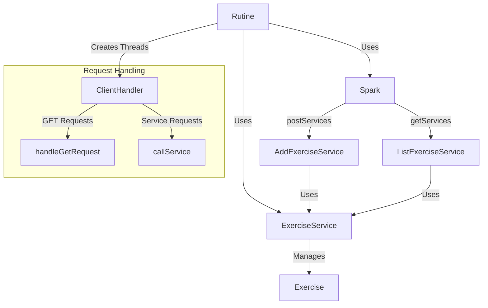

# AREP-LAB02
## Autor: David Leonardo Piñeros Cortés
#  TALLER DE MICROFRAMEWORKS WEB
El objetivo de este taller es completar nuestro servidor web construido durante el Taller 1, de forma que se convierta en un framework web simple funcional. Esto se hará mediante funciones lambda, manejo de variables dentro del request y la posibilidad de establecer el directorio
que alojará los archivos estáticos
## Instalación y Ejecución
El primer paso es instalar git y maven en su equipo, y luego de esto clonar el repositorio desde la terminal de la siguiente manera:
```
git clone https://github.com/leoncico/AREP-LAB02.git
``` 
Seguido de esto, se ingresa a la carpeta resultante y se ejecutan los siguientes comandos de Maven:
```
mvn clean install
```
A continuación, ingresa el último comando para ejecutar el servidor:
```
java -cp target/classes escuelaing.edu.co.spark.Rutine
```
Y finalmente ingresa desde un Browser a la dirección [localhost:8080/rutine.html]() para interactuar con la aplicación web.
## Arquitectura
La arquitectura utilizada se alinea con el patrón de Cliente - Servidor, en el cual existe un servidor que aloja todos los recursos (en un
directorio seleccionado por el desarrollador) y uno o más clientes pueden acceder y usar estos recursos por medio de solicitudes que son respondidas con ayuda de las funciones lambda y los servicios REST del Backend.
### Diagrama


## Evaluación
Además de pruebas unitarias de las clases que implementaban reglas de negocio, se llevaron a cabo pruebas de usuario con las funcionalidades de la aplicación


